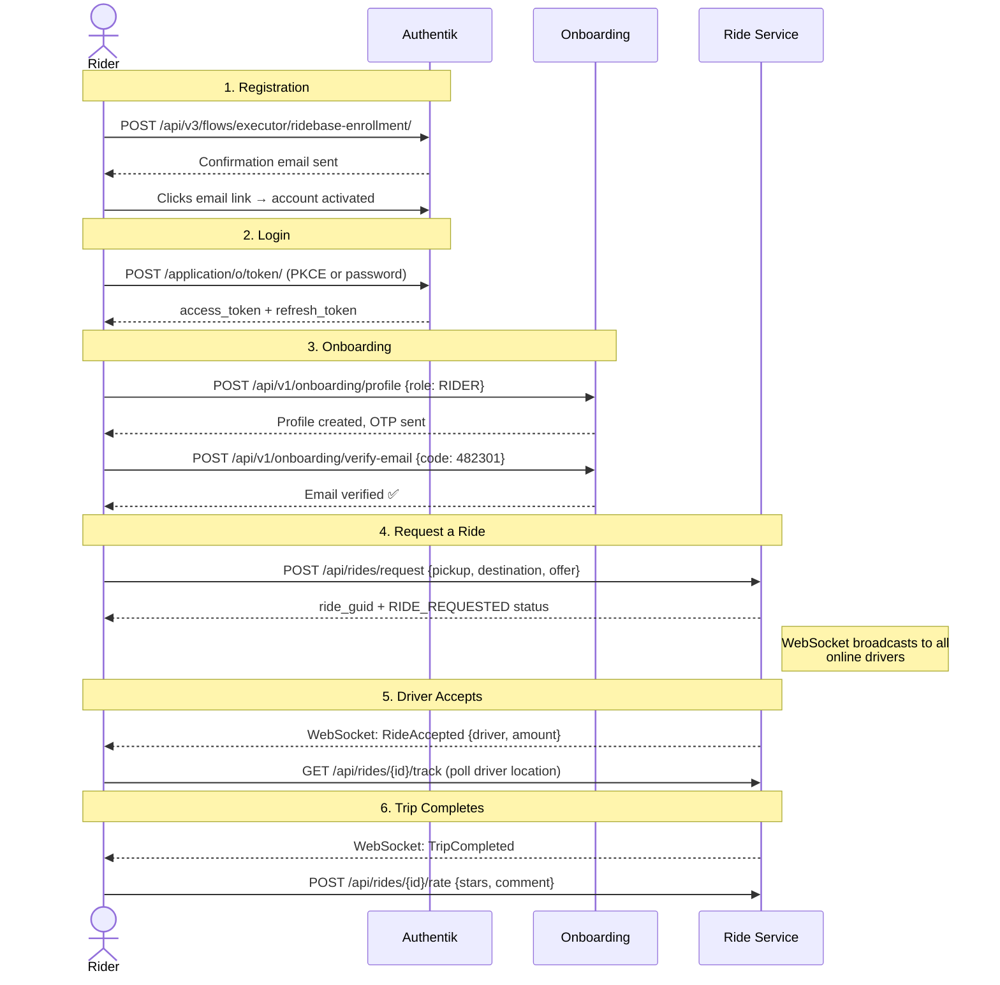
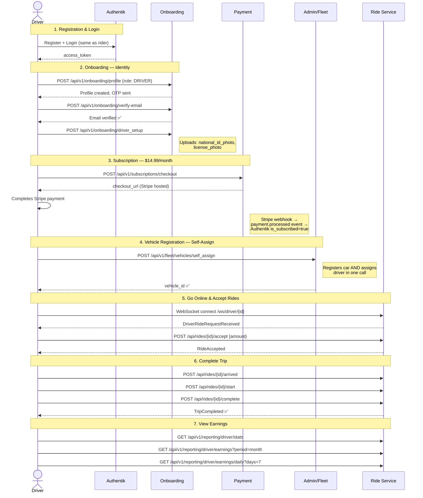
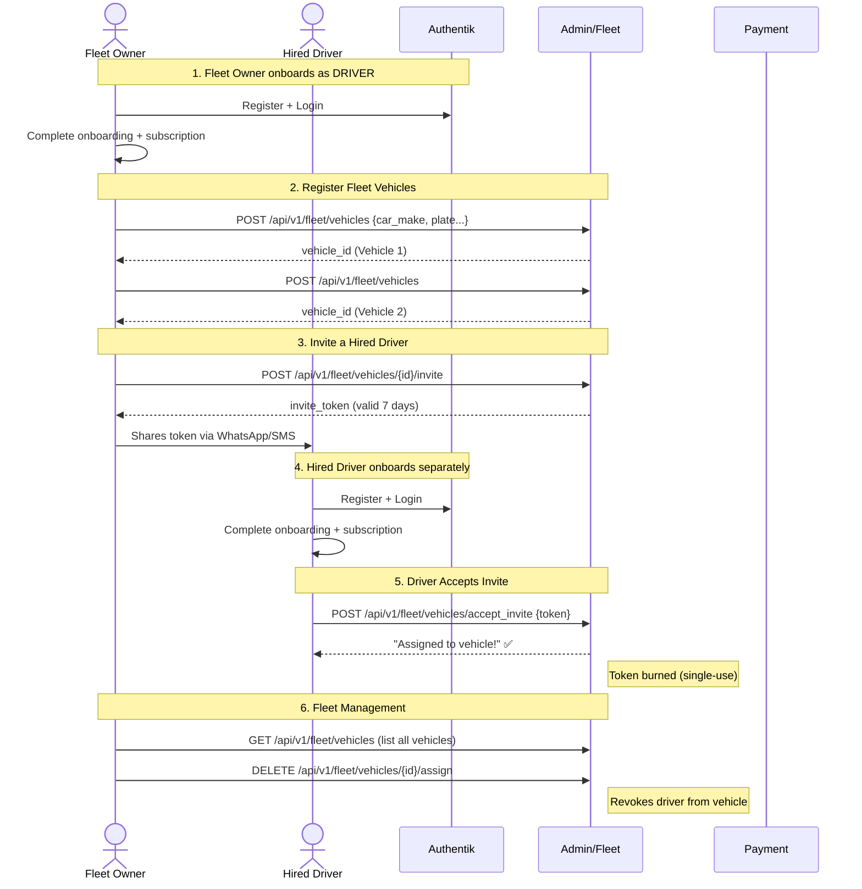
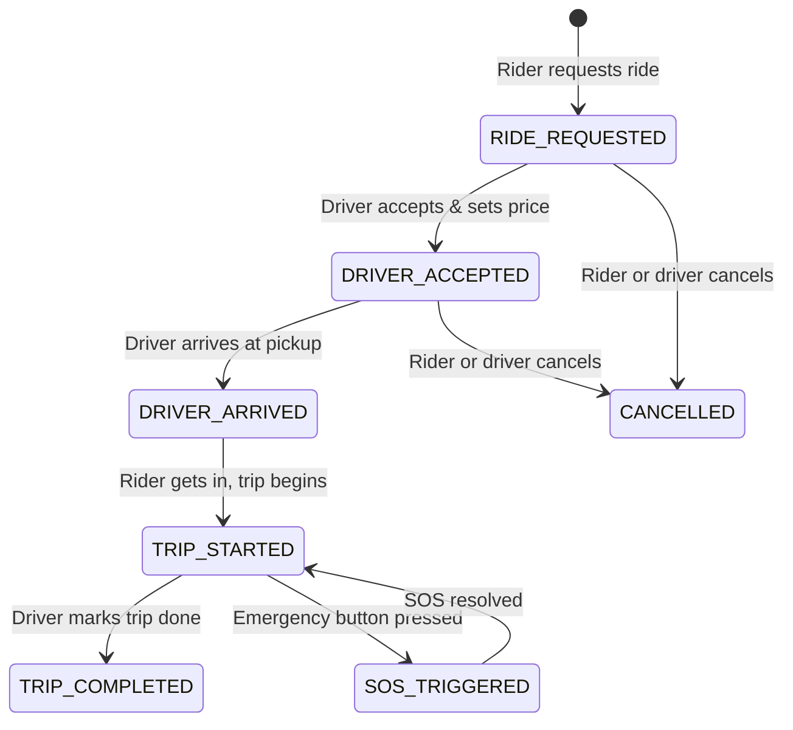
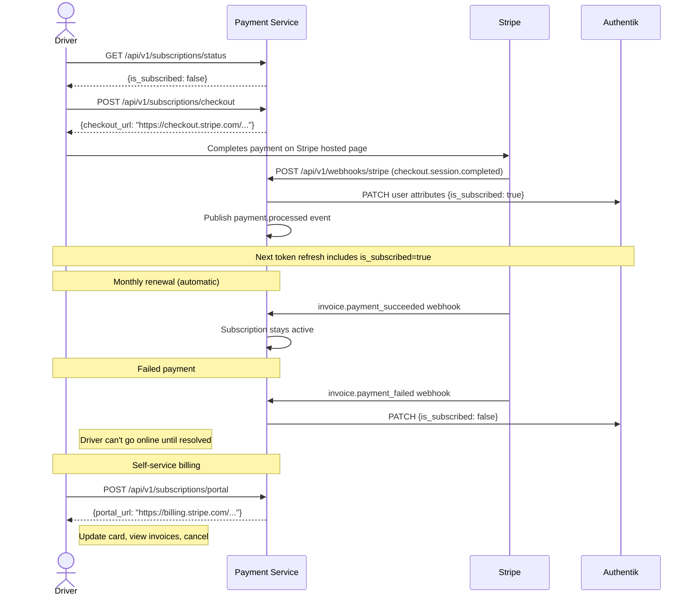
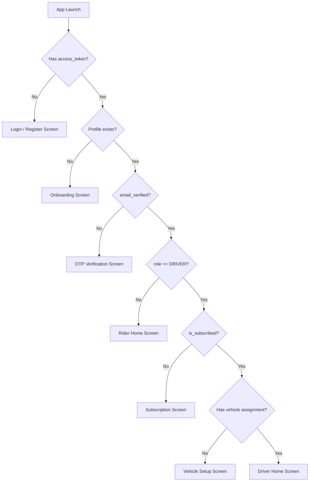

# RideBase Platform — User Flows Overview

A complete guide to how riders, drivers, and fleet owners interact with the platform from sign-up to ride completion.

---

## Architecture at a Glance

```
┌──────────────────────────────────────────────────────────────────┐
│                        Mobile App (MAUI)                         │
│  Rider UI  ·  Driver UI  ·  Fleet Owner UI  ·  Admin Dashboard  │
└──────────┬───────────────────────────────────────────────────────┘
           │ HTTPS + WebSocket
┌──────────▼───────────────────────────────────────────────────────┐
│                     Traefik (Reverse Proxy)                       │
├──────────────────┬───────────────┬──────────────┬────────────────┤
│ auth.ridebase    │ onboarding.   │ pay.ridebase │ fleet.ridebase │
│ .tech            │ ridebase.tech │ .tech        │ .tech          │
│                  │               │              │                │
│ ┌──────────────┐ │ ┌───────────┐│ ┌──────────┐ │ ┌────────────┐ │
│ │  Authentik   │ │ │Onboarding ││ │ Payment  │ │ │   Admin    │ │
│ │  (OIDC SSO)  │ │ │ Service   ││ │ Service  │ │ │  Service   │ │
│ └──────────────┘ │ └───────────┘│ └──────────┘ │ └────────────┘ │
│                  │              │              │                │
│                  │    Ride Service (internal)   │                │
│                  │    ┌────────────────────┐    │                │
│                  │    │  Rides · Reporting │    │                │
│                  │    └────────────────────┘    │                │
├──────────────────┴──────────────┴──────────────┴────────────────┤
│ PostgreSQL (HA) · RabbitMQ · Redis · S3 (Hetzner Object Store)  │
└─────────────────────────────────────────────────────────────────┘
```

---

## Service Responsibilities

| Service | Domain | Base URL |
|---------|--------|----------|
| **Authentik** | Identity, SSO, JWT issuance | `auth.ridebase.tech` |
| **Onboarding Service** | User profiles, driver verification, email OTP | `onboarding.ridebase.tech` |
| **Payment Service** | Stripe subscriptions ($14.99/mo driver fee) | `pay.ridebase.tech` |
| **Admin/Fleet Service** | Vehicle registration, driver assignment, invites | `fleet.ridebase.tech` |
| **Ride Service** | Ride lifecycle, WebSocket matching, driver reporting | Internal |

---

## Flow 1: Rider Sign-Up & First Ride



### Key Details

- **Auth method**: PKCE (mobile) or password grant (testing)
- **Role**: `RIDER` — no subscription required, no vehicle setup
- **OTP**: 6-digit code sent via Resend to the user's email
- The rider can also sign up via **Google OAuth** (redirect through Authentik)

---

## Flow 2: Independent Driver (Owns Their Car)



### Key Details

- **Subscription gate**: The mobile app checks `is_subscribed` from the JWT. If `false`, the driver is prompted to subscribe before going online.
- **Self-assign endpoint**: `POST /vehicles/self_assign` is the simplest path — it creates the vehicle record AND the assignment in a single transaction.
- **Identity vs vehicle**: Onboarding handles identity documents (national ID, license). Fleet Service handles the vehicle asset.

---

## Flow 3: Fleet Owner with Hired Drivers



### Key Details

- **Invite tokens**: Cryptographically secure (`secrets.token_urlsafe(32)`), single-use, expire in 7 days
- **One active driver per vehicle**: A vehicle can only have one `ACTIVE` assignment at a time. The fleet owner must revoke the current driver before assigning a new one.
- **Both pay**: Both the fleet owner and the hired driver need their own $14.99/month subscription to use the platform. The subscription is per-user, not per-vehicle.

---

## Flow 4: Ride Lifecycle (Real-Time)



### Ride Status Transitions

| Status | Who Triggers | What Happens |
|--------|-------------|--------------|
| `RIDE_REQUESTED` | Rider | Broadcasted to all online drivers via WebSocket |
| `DRIVER_ACCEPTED` | Driver | Rider notified, driver location tracking begins |
| `DRIVER_ARRIVED` | Driver | Rider gets "driver has arrived" notification |
| `TRIP_STARTED` | Driver | Trip distance tracking begins |
| `TRIP_COMPLETED` | Driver | Fare finalized, rating prompt shown |
| `CANCELLED` | Either | Cancellation reason recorded |
| `SOS_TRIGGERED` | Either | Emergency contacts notified |

### RabbitMQ Events (Ride Service)

Every status change publishes an event to the `ridebase.events` exchange:

```
ride.requested    → {ride_id, rider_id, pickup, destination}
ride.accepted     → {ride_id, driver_id, accepted_amount}
ride.completed    → {ride_id, driver_id, final_amount, distance_km}
ride.cancelled    → {ride_id, cancelled_by, reason}
ride.sos          → {ride_id, triggered_by, location}
```

---

## Flow 5: Subscription & Billing



### Subscription States

| Stripe Status | `is_subscribed` | Can Drive? |
|---------------|----------------|------------|
| `active` | `true` | ✅ |
| `trialing` | `true` | ✅ |
| `past_due` | `false` | ❌ |
| `canceled` | `false` | ❌ |
| `incomplete` | `false` | ❌ |

---

## Flow 6: Reporting & Analytics

### Driver-Facing (in the app)

| Endpoint | What It Shows |
|----------|--------------|
| `GET /reporting/driver/stats` | Lifetime stats: total rides, earnings, avg rating, SOS count |
| `GET /reporting/driver/earnings?period=month` | Earnings for a time period (today/week/month/year) |
| `GET /reporting/driver/earnings/daily?days=7` | Day-by-day earnings breakdown chart |
| `GET /reporting/driver/rides?page=1&status=TRIP_COMPLETED` | Paginated ride history with filters |

### Platform-Wide (admin dashboard)

| Endpoint | What It Shows |
|----------|--------------|
| `GET /reporting/platform/stats?period=month` | Total rides, revenue, cancellation rate, avg rating, active SOS |

---

## RabbitMQ Event Map

All services publish to the shared `ridebase.events` topic exchange. Any service can bind a queue to consume events it cares about.

```
ridebase.events (topic exchange)
├── onboarding.*
│   ├── onboarding.profile_created
│   ├── onboarding.driver_role_assigned
│   └── onboarding.email_verified
├── payment.*
│   ├── payment.processed
│   ├── payment.subscription_cancelled
│   └── payment.subscription_renewed
├── fleet.*
│   ├── fleet.vehicle_registered
│   ├── fleet.driver_assigned
│   ├── fleet.driver_unassigned
│   ├── fleet.invite_generated
│   └── fleet.invite_accepted
└── ride.*
    ├── ride.requested
    ├── ride.accepted
    ├── ride.completed
    ├── ride.cancelled
    └── ride.sos
```

---

## Pre-Conditions & Gates

The mobile app enforces these checks to ensure a clean user experience:



| Gate | Service | Check |
|------|---------|-------|
| Authenticated | Authentik | Valid JWT exists |
| Profile exists | Onboarding | `GET /onboarding/me` returns 200 |
| Email verified | Onboarding | `email_verified == true` on profile |
| Subscribed | Payment | `is_subscribed == true` in JWT |
| Vehicle assigned | Fleet | `GET /fleet/vehicles` returns ≥ 1 result |
